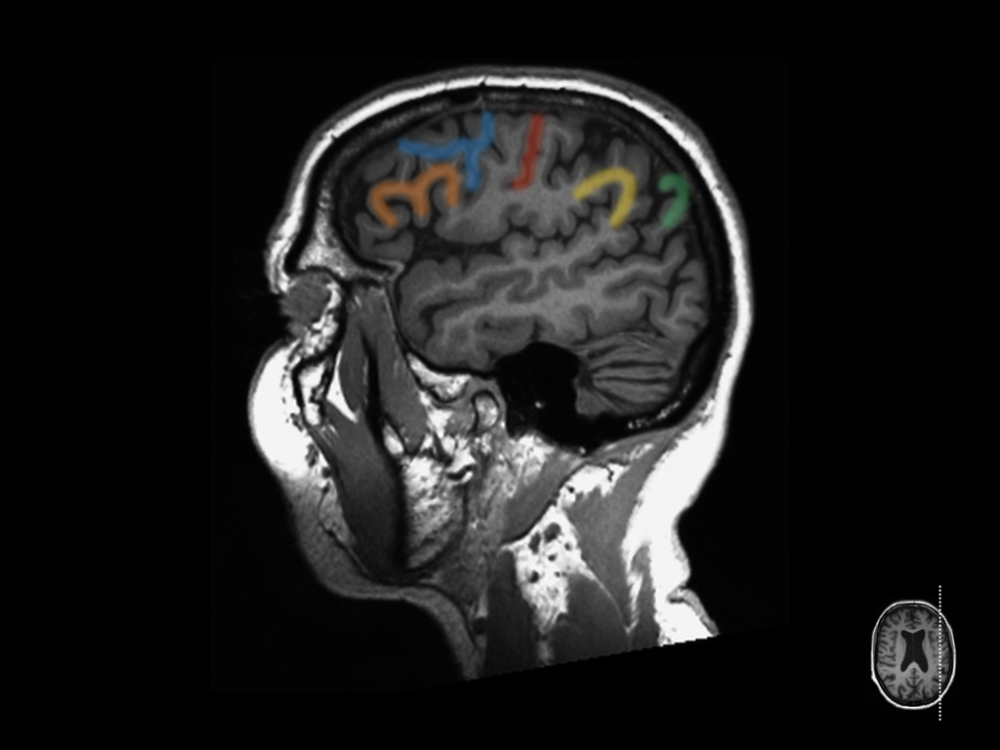
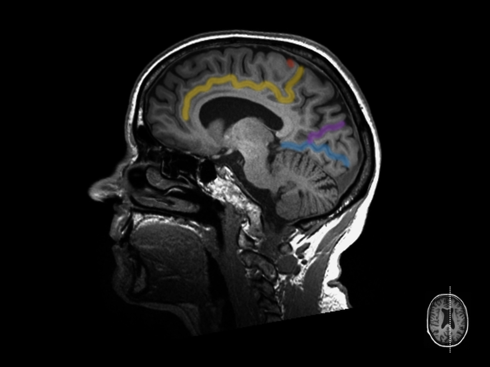
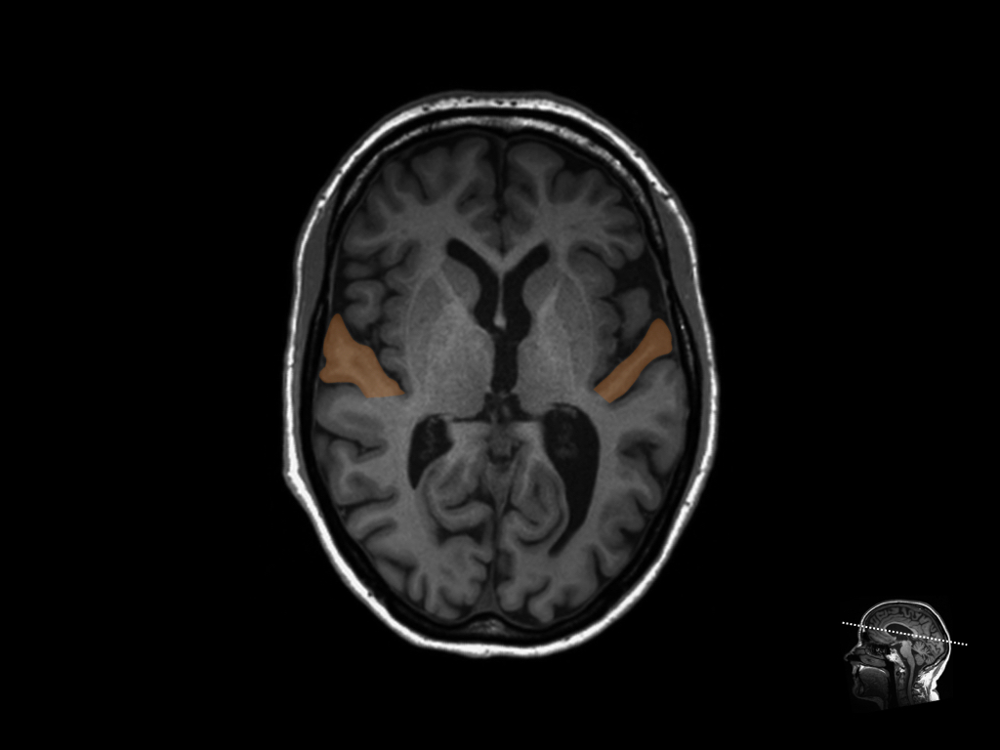
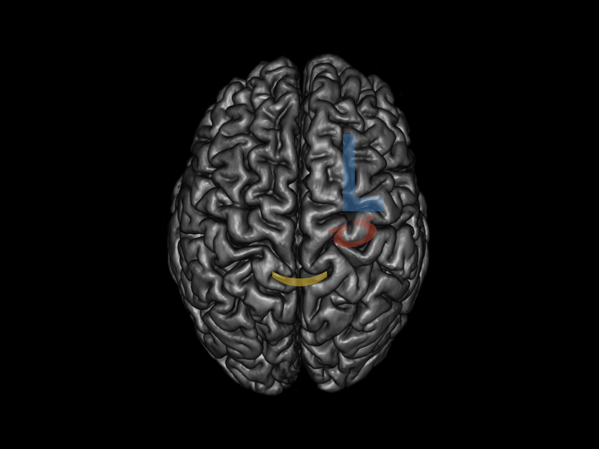
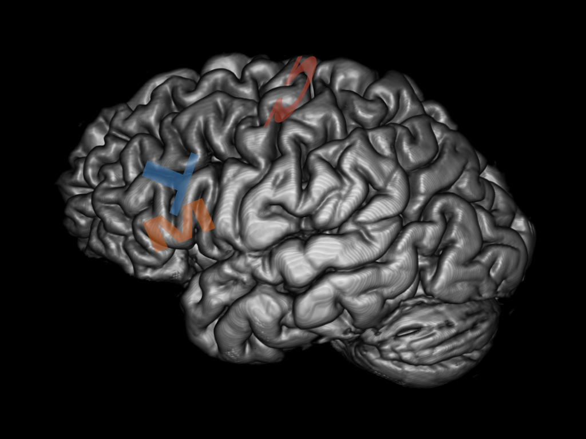

# A Guide to Cortical Landmarks in MRI
The identification of eloquent brain areas comprises an integral part in the planning and execution of neurosurgical procedures. Cortical landmarks as seen on MRI can be applied for the localization of eloquent brain regions. This chapter illustrates methods for the identification of key anatomical landmarks based on their specific form, course and their relationship to adjacent structures.


## Primary Motor and Sensory Cortex / Central Sulcus
The central sulcus is a prominent landmark, separating the primary motor cortex in the precentral gyrus of the frontal lobe from the primary sensory cortex in the postcental gyrus of the parietal lobe. It is particularly well identifiable on transverse sections. The following signs help identify the central sulcus in transverse and sagittal sections _(fig. 1,2,3 | red)_.

### L Sign
The superior frontal sulcus (SFS) joins in its antero-posterior course the precentral sulcus (PCS) in an almost perpendicular fashion resembling an upper case ‘L’ (L Sign / SFS-PCS Sign). The central sulcus is the next posterior, parallel sulcus \@ref(t1-sagittal)}.

### Omega Sign
The motor hand area is most often contained in a knob-like, posterior protuberance of the precentral gyrus, shaping the central sulcus into an inverted omega ‘℧’. It is also known as the 'middle-knee' of the precentral gyrus _(fig. 1 | red)_.

### Thin-Postcentral-Gyrus Sign
The antero-posterior diameter of the postcentral gyrus is smaller than that of the precentral gyrus _(fig. 1 | green)_.

### Pars-Bracket Sign
On sagittal sections (fig. 3) the cingulate sulcus ascends in its antero-posterior course to the surface of the parietal lobe and separates the paracentral lobule from the precuneus as the marginal sulcus. On reaching the cortical surface it forms a characteristic anteriorly opened bracket that can be appreciated on transverse sections (fig. 1). The central sulcus is situated immediately anterior and parallel to the bracket _(fig. 1,3 | yellow)_.

### T Sign
The well identifiable inferior frontal sulcus (IFS) and the precentral sulcus (PCS) intersect almost perpendicular forming an upper case T tilted 90° clockwise (IFS-PCS-sign). The central sulcus is located immediately parallel and posterior to the roof of the T _(fig. 2)_.


## Speech Associated Areas / Inferior Frontal Gyrus
### M Sign
The inferior frontal gyrus forms a typical upper case M shape on sagittal sections. It can be subdivided into three macroanatomical parts from anterior to posterior represented by the legs of the upper case M (orbital, triangular and opercular). The triangular and opercular parts of the dominant hemisphere are active in semantic and word generation tasks and have become known as Broca's area _(fig. 2 | orange)_.

### T Sign
The inferior frontal gyrus is superiorly bound by the inferior frontal sulcus and posteriorly by the inferior precentral sulcus. Both are part of the sagittal T Sign (See Central Sulcus | T Sign) _(fig. 2 | blue)_.


## Supramarginal Gyrus
The silvian fissure ascends with its posterior ramus into the inferior parietal lobule where it is imbedded into the semicircular supramarginal gyrus with horseshoe appearance. It is involved in phonological word choices and visual word recognition _(fig. 2 | yellow)_.


## Angular Gyrus
Just inferior to the sylvial fissure lies the superior temporal gyrus and sulcus. The superior temporal sulcus ascends posteriorly, parallel to the silvian fissure. Its dorsal upswing is called the angular sulcus which is imbedded by the curved angular gyrus, that is situated directly posterior to the supramarginal gyrus.  The angular gyrus plays a role in language processing, arithmetics and spatial cognition. Demage to the angular gyrus of the dominant hemisphere can manifest as Gerstmann's syndrome _(fig. 2 | green)_.


## Primary Visual Cortex / Calcarine Sulcus
_(fig. 3 | blue)_
### Lazy-Y Sign
<!-- Imaging of the Brain, Expert Radiology Series, Thomas P. Naidich -->
The occipital and parietal lobes are separated by the perieto-occipital sulcus. It can be appreciated in just off midline sagittal sections and runs roughly parallel to the marginal sulcus in an oblique fashion from antero-inferior to supero-posterior (fig. 3 | purple). The calcarine sulcus runs from almost the occipital pole anteriorly where it ends just below the splenium of the corpus callosum (fig. 3 | blue). In its anterior part it is joined in an acute angle by the parieto-occipital sulcus  forming a 90° clockwise tilted lazy-Y. The banks of the calcarine sulcus contain the primary visual cortex _(fig. 3 | blue, purple)_.

## Primary Auditory Cortex / Transverse Temporal Gyrus of Heschl
Hidden within the posterior part of the sylvian fissure the transverse temporal gyrus of Heschl is the first cortical structure to process incoming auditory information. It can be appreciated in transverse crossections as the first mediolaterally running gyrus of the temporal lobe, posterior to the insular cortex _(fig. 4 | orange)_.


#### Figure 1


#### Figure 2
```{r t1-sagittal}

```


#### Figure 3


#### Figure 4


#### Figure 5


#### Figure 6

